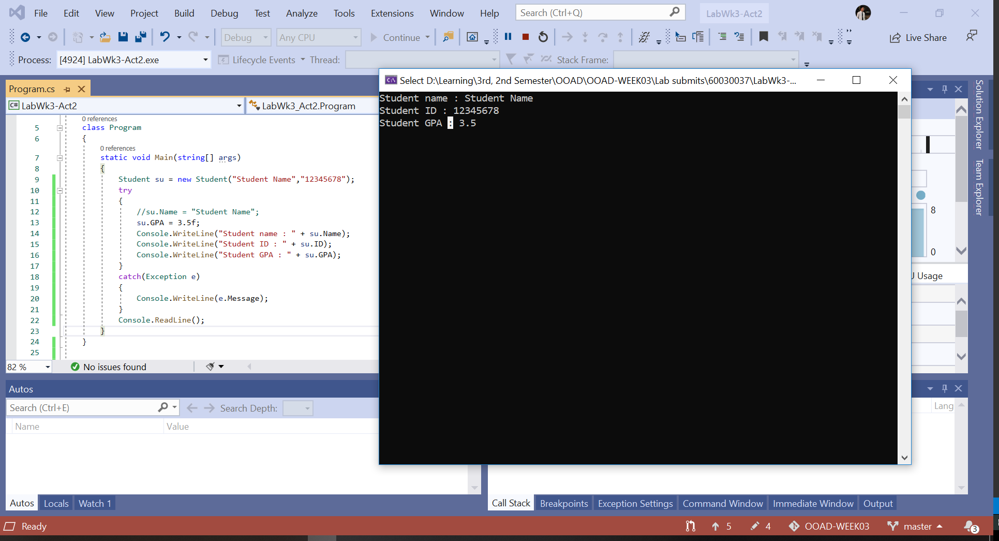
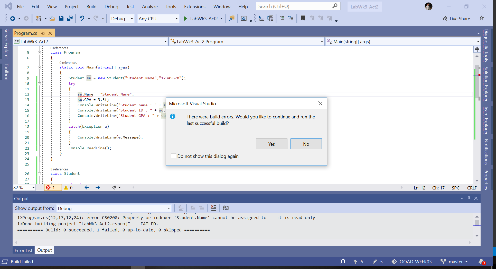
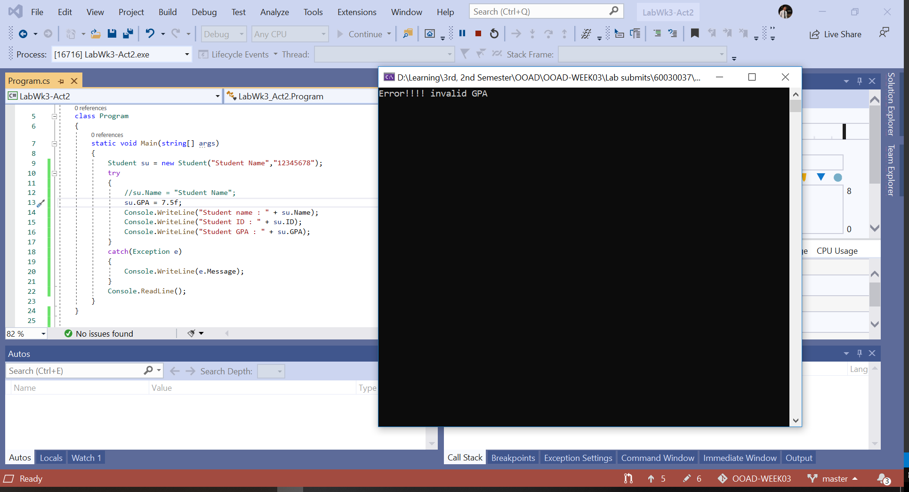
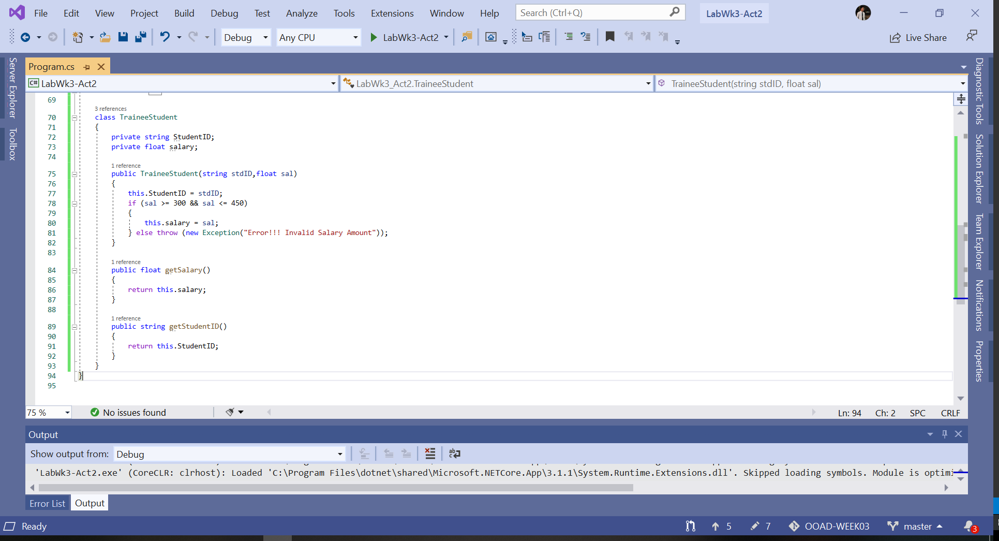

# การทดลองเรื่องการปกปิดข้อมูลหรือการห่อหุ้ม (Encapsulation)
## 1. การเข้าถึง fields แบบ public

ให้เขียนโปรแกรมตาม code snippet ต่อไปนี้ แล้วรันโปรแกรม
``` C#
class Program
{
    static void Main(string[] args)
    {
        Student su = new Student();
        su.Name = "Student Name";
        su.ID = "12345678";
        su.GPA = 3.5f;
        Console.WriteLine("Student name : " + su.Name);
        Console.WriteLine("Student ID   : " + su.ID);
        Console.WriteLine("Student GPA  : " + su.GPA);
        Console.ReadLine();
   }
}
class Student
{
    public string Name;
    public string ID;
    public float GPA;
}
```

จากโปรแกรมด้านบน ให้เปลี่ยนบรรทัดที่ 8  ```(su.GPA = 3.5f;)``` เป็น ```su.GPA = 7.5f;``` 

รันและสังเกตผลการทำงานของโปรแกรม มีสิ่งใดผิดปกติหรือไม่ อย่างไร
```
ไม่มีสิ่งใดผิดปกติ สามารถรันได้ตามปกติ แต่ในส่วนของ GPA นั้นอยู่นอกเหนือขอบเขตที่เป็นไปได้ตามความเป็นจริง
```

จาก code ด้านบน จะเห็นว่าเราสามารถเข้าถึง fields ต่างๆ ของคลาส Student จากภายนอกได้อย่างอิสระ ซึ่งขัดกับหลักการปกปิดข้อมูลของ OOP เราจำเป็นต้องปกปิดข้อมูลดังกล่าว โดยการกำหนดให้ field ในคลาส Student มี modifier เป็น private ให้แก้ไขโปรแกรมเป็นดังนี้

``` C#
class Student
{
    private string Name;
    private string ID;
    private float GPA;
}
```

รันและสังเกตผลการทำงานของโปรแกรม มีสิ่งใดผิดปกติหรือไม่ อย่างไร
```
ไม่สามารถรันได้อันเนื่องมาจากไม่สามารถเข้าถึงข้อมูลได้จากขอบเขตการเข้าถึงของข้อมูลที่กำหนดใหม่เป็น private
```

## 2. การเข้าถึง fields ผ่านทาง properties
เนื่องจากเราต้องการให้ fields ถูกปิดบังจากภายนอกจึงต้องกำหนด access modifier เป็น private ทำให้ผลที่ตามมาคือ ไม่สามารถกำหนดค่าให้กับ fields ต่างๆ ได้ เราจึงต้องพึ่งองค์ประกอบอีกอย่างหนึ่ง ของคลาสซึ่งสามารถมี modifier เป็น public  โดยไม่ขัดกับกฏของ OOP นั่นก็คือ properties

ให้แก้ไขคลาส Student โดยการเพิ่ม properties และเปลี่ยนชื่อตัวแปรสำหรับ fields เป็นตัวพิมพ์เล็กดังต่อไปนี้

``` c# 
class Student
{
    private string name;
    private string id;
    private float gpa;
    public string Name
    {
        get { return name; }
        set { name = value; }
    }
    public string ID
    {
        get { return id; }
        set { id = value; }
    }
    public float GPA
    {
        get { return gpa; }
        set { gpa = value; }
    }
}
```
รันและสังเกตผลการทำงานของโปรแกรม มีสิ่งใดผิดปกติหรือไม่ อย่างไร
```
ไม่มีสิ่งใดผิดปกติ สามารถรันได้ตามปกติ แต่ในส่วนของ GPA นั้นอยู่นอกเหนือขอบเขตที่เป็นไปได้ตามความเป็นจริง
```

## 3. การตรวจสอบความถูกต้องของข้อมูลโดย properties

การใช้งาน properties มีประโยชน์ในเรื่องการควบคุมการเข้าถึงข้อมูล (ผ่านเมธอด getter และ setter) จากตัวอย่างด้านบนจะพบว่า GPA ยังคงมีค่าเป็น 7.5 ซึ่งมีค่าเกินปกติ 4.0 ซึ่งเราสามารถตรวจสอบความถูกต้องของข้อมูล ได้ในเมธอด setter หรือ getter  ให้แก้โปรแกรมเป็นดังต่อไปนี้

``` C#
class Program
{
    static void Main(string[] args)
    {
        Student su = new Student();
        try
        {
            su.Name = "Student Name";
            su.ID = "12345678";
            su.GPA = 7.5f;
            Console.WriteLine("Student name : " + su.Name);
            Console.WriteLine("Student ID   : " + su.ID);
            Console.WriteLine("Student GPA  : " + su.GPA);
        }
        catch (Exception e)
        {
            Console.WriteLine(e.Message);
        }
        Console.ReadLine();
    	}
}

class Student
{
    private string name;
    private string id;
    private float gpa;
    public string Name
    {
        get { return name; }
        set { name = value; }
    }
    public string ID
    {
        get { return id; }
        set { id = value; }
    }
    public float GPA
    {
        get 
        { 
            return gpa; 
        }
        set 
        {
            if (value > 0.0 &&  value <= 4.0 )
                gpa = value;
            else
                throw (new Exception("Error!!!! invalid GPA"));
        }
    }
}
```

### อธิบายการทำงานของโปรแกรม
โปรแกรมด้านบนนี้ จะมีการตรวจสอบความถูกต้องของข้อมูลโดยเมธอด setter ของคลาส Student ถ้าหากข้อมูลที่ป้อนไม่ถูกต้องจะมีการ throw exception และจะไปรับการ exception ในประโยค try-catch ของฝั่งผู้เรียก  แต่ถ้าข้อมูลที่ป้อนอยู่ในขอบเขตที่ถูกต้อง จะรายงานผลออกมาตามปกติ 

ทดลองเปลี่ยนค่าให้อยู่ในขอบเขตที่ถูกต้อง แล้วรันและบันทึกผลการทดลอง
```
สามารถรันโปรแกรมได้ตามปกติ และค่าของ GPA ต้องอยู่ในขอบเขตที่ถูกต้องเท่านั้นจึงจะแสดงผลข้อมูลต่าง ๆ (ที่ไม่ใช่ Exception) บนหน้าจอ Console แต่ถ้าค่าของ GPA อยู่ในขอบเขตที่ไม่ถูกต้องบนหน้าจอ Console นั้น จะแสดงผล Exception "Error!!!! invalid GPA"
```

## 4. การกำหนดวิธีการเข้าถึงข้อมูลภายในคลาส

โปรแกรมด้านบน ยังมีจุดอ่อนอีกประการหนึ่งคือ ผู้ใช้สามารถแก้ไข properties ที่ชื่อ  Name และ ID ของวัตถุที่สร้างจากคลาส Student ได้  การป้องกันการแก้ไขข้อมูลจากภายนอก สามารถทำได้โดยการลบเมธอด setter ออกไปจาก property ของคลาส แต่ผลที่ตามมาก็คือ เราจะไม่สามารถกำหนดค่าเริ่มต้นให้กับวัตถุได้ แต่ยังโชคดีที่คลาสได้ให้ทางออกอย่างหนึ่งแก่เรา นั่นคือการใช้ constructor

จากโปรแกรมด้านบนเราจะพบว่า Name และ ID มี setter อยู่ ซึ่งเป็นหนทางเดียวที่จะนำข้อมูลเข้าไปยังคลาส เราต้องลบออกไป และเพิ่ม constructor ที่รับพารามิเตอร์จำนวน 2 ตัว (ได้แก่ Name และ ID) มาทำหน้าที่ดังกล่าวแทน เมื่อทำดังนั้นแล้ว เราจะได้คลาส Student ที่สามารถกำหนดชื่อและ ID ได้ในขณะสร้างวัตถุและไม่สามารถแก้ไขในภายหลังได้

ให้แก้โปรแกรมเป็นดังต่อไปนี้
 
``` C#
class Program
{
    static void Main(string[] args)
    {
        Student su = new Student("Student Name", "12345678");
        try
        {
            // su.Name = "My name";
            su.GPA = 3.5f;
            Console.WriteLine("Student name : " + su.Name);
            Console.WriteLine("Student ID   : " + su.ID);
            Console.WriteLine("Student GPA  : " + su.GPA);
        }
        catch (Exception e)
        {
            Console.WriteLine(e.Message);
        }
        Console.ReadLine();
    }
}
class Student
{
    private string name;
    private string id;
    private float gpa;

    public Student(string Name, string ID)
    {
        this.name = Name;   // assign auto variable to the field
        this.id = ID;  	 
    }

    public string Name
    {
        get { return name; }
    }
    public string ID
    {
        get { return id; }
    }
    public float GPA
    {
        get 
        { 
            return gpa; 
        }
        set 
        {
            if (value > 0.0 &&  value <= 4.0 )
                gpa = value;
            else
                throw (new Exception("Error!!!! invalid GPA"));
        }
    }
}
```

จงอธิบายการทำงานของโปรแกรมด้านบน ว่าเกิดอะไรขึ้น เพราะอะไร
ให้ทำการ uncomment บรรทัด ```// su.Name = "My name";``` (โดยการลบ  // ด้านหน้า su.Name = "My name"; ออกไป) แล้วรันโปรแกรม พร้อมทั้งบันทึกผล และอธิบายให้เหตุผลประกอบ
ทดลองเปลี่ยน GPA เป็นค่าที่มากกว่า 4.0  ผลที่ได้เป็นเช่นไร
```
เมื่อทำการสร้างวัตถุขึ้นมา วัตถุจะถูกกำหนดค่า name และ id ผ่านทาง Constructor และหากทำการ uncomment บรรทัด // su.Name="Student Name"; จะไม่สามารถรันได้เนื่องจาก property Name ของ Class นี้เป็นแบบ Read-Only และหากกำหนดค่า GPA เป็นค่าที่มากกว่า 4.0 จะปรากฎ Exception "Error!!!! invalid GPA" บนหน้าจอ Console
``` 



 
## สรุปผลการทดลอง
```
ในการสร้าง Class หนึ่ง ๆ ขึ้นมานั้น เพื่อให้ถูกต้องตามหลักการแล้วต้องกำหนดให้ field ทุก field เป็นชนิด private และให้เข้าถึงผ่าน Property เท่านั้น และหาก field ใดที่ต้องการให้กำหนดค่าได้เพียงครั้งเดียวต้องกำหนดผ่านทาง Contructor ในส่วนของ Property นั้นจะมีในส่วนของ setter และ getter ซึ่งสำหรับการ setter นั้น เราสามารถเพิ่มเงื่อนไขข้อมูลที่ต้องการได้อีกด้วย
```


##  คำถาม
นักศึกษาที่เรียนในชั้นปีที่ 3 ของภาควิชาครุศาสตร์วิศวกรรม จะต้องออกฝึกงานในสถานประกอบการด้านอุตสาหกรรม นักศึกษาจะได้รับเงินเดือนในการทำงาน ตามค่าแรงขั้นต่ำ (ปัจจุบัน คือ 300 บาท) แต่ไม่เกิน 450 บาทต่อวัน 

ให้เขียนคลาส TraineeStudent ที่มี field ชื่อ StudentID และ salary โดยทั้งคู่จะถูกกำหนดค่าผ่าน constructor แต่จะมีเมธอดที่ชื่อ getSalary() และ getStudentID() ไว้อ่านค่าตัวแปร field ทั้งสอง

